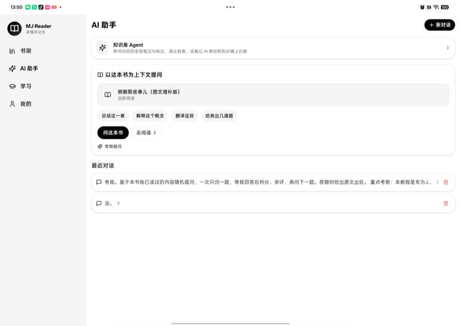
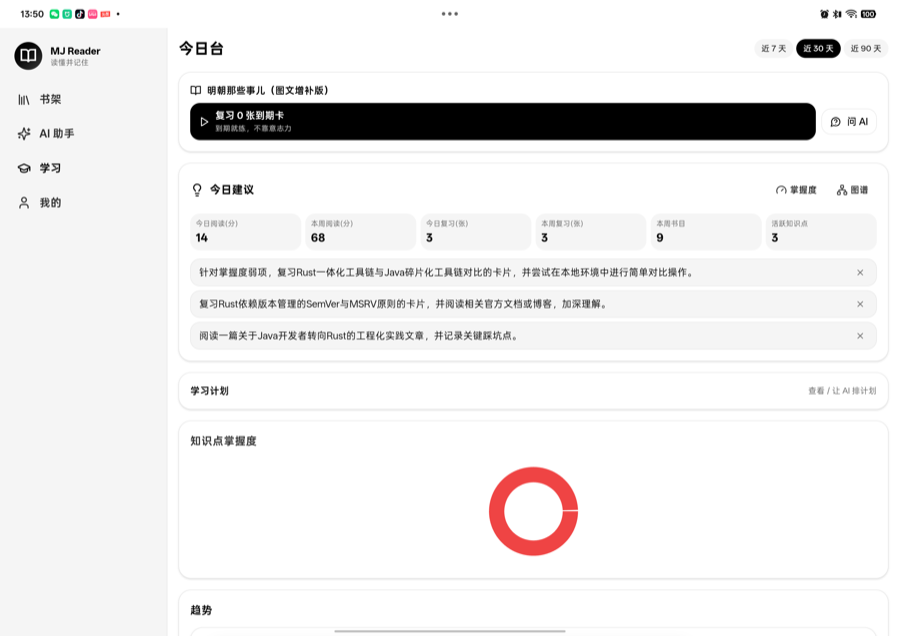

# MJNexus-Reader

**English** | [简体中文](./README.zh-CN.md)

> A reading + learning + AI-assisted companion for learners. Read a book, then let AI help you break it down, drill what you forgot, and remember it — built around a read → learn → practice → recall loop.

[](./LICENSE)
[](#platform-support)
[](https://tauri.app)

---

## Screenshots

| Bookshelf | AI Assistant | Learning |
| :---: | :---: | :---: |
|  |  |  |

<sub>Captured on a physical OPPO device (Snapdragon 8 Elite, 11 GB RAM).</sub>

---

## What it does

MJNexus-Reader is a complete reading-and-learning stack for people who read to understand: import a book, read it, annotate it, let AI break it down, then drill the parts you forgot — all organized around a read → learn → practice → recall loop.

### Library and reading

- **Formats** — EPUB, PDF, MOBI, TXT, DOCX, PPTX, XLSX, Markdown, comic archives
- **Readers** — reflowable engine (foliate-js) for EPUB/MOBI, PDF.js for PDF, dedicated layouts for office and comic files
- **Library** — directories, tags, bulk import, Wi-Fi transfer from a desktop browser
- **Annotations** — highlights, bookmarks, marginal notes, free-hand whiteboard attached to any page
- **Full-text search** — SQLite FTS5 with a custom bigram tokenizer (trigram tokenizers do not work for Chinese)

### AI layer

- **Book breakdown** — chapter-by-chapter structure, arguments and takeaways, generated by your configured AI provider
- **AI assistant** — conversational Q&A grounded in the book you are reading
- **Knowledge graph** — concepts and relations extracted from one book or across the whole library
- **Quiz and review** — generated questions plus a spaced-repetition scheduler (SM-2 variant) and Anki export
- **Teaching mode** — the AI explains a concept back to you and grades your retelling
- **Mind maps and knowledge cards** — visual condensation of what you read

### Learning loop

- **Today's desk** — one screen for due reviews, weak points and reading streaks
- **Mastery tracking** — per-concept proficiency inferred from quiz history
- **Reading reports** — speed, retention and time-of-day analytics
- **Learning paths** — ordered curricula assembled from your bookshelf

### AI backend

The assistant, book breakdown, knowledge graph, quiz generation, teaching mode and mind maps all run against a **pluggable AI provider** you configure in Settings:

- **Cloud LLM API** — any OpenAI-compatible endpoint (bring your own key). Best for speed and the largest models.
- **Local Ollama** — point the app at an Ollama server running on your machine or device for fully local, offline inference (no key, no upload).
- No model weights are bundled with the app; you decide where inference happens.

### Also included

- **OCR** (PP-OCRv5 via ONNX Runtime) for scanned pages and images
- **TTS / ASR** — Edge TTS playback; recognition via Android SpeechRecognizer, Apple `SFSpeechRecognizer`, or SenseVoice
- **Sync and backup** — encrypted payloads (Argon2id + AES-GCM), conflict detection, local snapshots
- **MCP client** — connect external tool servers to the assistant
- **i18n** — Chinese and English, every UI string keyed (no hard-coded literals)

---

## Tech stack

| Layer | Stack |
| --- | --- |
| Shell | [Tauri 2.11](https://tauri.app) (Rust) |
| Frontend | React 18.3, TypeScript, Vite, Tailwind, Zustand 5, react-router 6, i18next |
| Backend | Rust — 161 source files, ~70k lines, **364 Tauri commands** across 50 modules |
| Database | SQLite via sqlx 0.8, 74 tables, FTS5 + custom bigram tokenizer |
| AI backend | Pluggable providers — cloud LLM API (OpenAI-compatible) or local Ollama |
| OCR | ONNX Runtime (PP-OCRv5) |
| Renderers | foliate-js, PDF.js 6, mammoth, mermaid, `@xyflow/react` |

---

## Project structure

```
mjnexus-reader/
├── frontend/                 # React + TypeScript UI
│   └── src/
│       ├── routes/           # 17 top-level pages + nested ai/ me/ whiteboard/
│       ├── components/       # shared UI
│       ├── services/         # typed wrappers over Tauri commands
│       ├── stores/           # zustand state
│       ├── i18n/             # zh-CN / en locales
│       ├── ai/               # AI conversation orchestration
│       └── renderer/         # book format renderers
├── src-tauri/                # Rust backend
│   └── src/
│       ├── commands/         # 50 modules, 364 #[tauri::command] handlers
│       ├── services/         # 26 services (parser, book_fts, local_llm,
│       │                     #   device_tier, model_hub, ocr_engine, sync, mcp, ...)
│       ├── db/               # schema, migrations, soft-delete, FTS
│       └── lib.rs            # command registration, plugins, setup
├── docs/screenshots/         # UI screenshots
├── scripts/                  # build and consistency checks
├── LICENSE                   # PolyForm Shield 1.0.0
└── NOTICE                    # Required Notice + Licensor Line of Business
```

---

## Getting started

### Prerequisites

- Node.js 18+ and npm
- Rust 1.77+ (`rustup`)
- Platform toolchain: Xcode (iOS/macOS), Android SDK + NDK 28 (Android), or standard build tools for desktop

### Run in development

```bash
cd frontend && npm install
cd ../src-tauri && cargo tauri dev
```

### Build a release

```bash
# Desktop (macOS / Windows / Linux)
cargo tauri build
```

```bash
# Android APK
cargo tauri android build --apk --target aarch64 \
  --features android-asr,android-wakelock
```

```bash
# iOS IPA
DEVELOPER_DIR=/Applications/Xcode.app \
cargo tauri ios build --target aarch64
```

> **AI runs through the provider you configure** — a cloud LLM API or a local Ollama server. No model weights are bundled, so the default build stays lean. To embed an on-device engine instead, add the `llamacpp` feature (advanced, large native library).

### Quality gates

```bash
cd frontend
npm run typecheck          # tsc --noEmit
npm run lint               # eslint
npm test                   # vitest
npm run i18n-check         # locale parity
npm run gate               # all of the above + build

cd ../src-tauri
cargo test --lib           # 442 unit tests
cargo check                # warnings are ratcheted, never increased
```

---

## Platform support

| Platform | Status | AI backend |
| --- | --- | --- |
| Android (arm64) | Built and tested on device | Cloud API / local Ollama |
| iOS / iPadOS (arm64) | Built and tested on device | Cloud API / local Ollama |
| macOS (Apple Silicon) | Supported | Cloud API / local Ollama |
| Windows / Linux | Supported | Cloud API / local Ollama |

---

## Download

Prebuilt binaries are published on the [Releases](https://github.com/jasonma1210/MJ-reader/releases) page:

- `app-universal-release.apk` — Android arm64
- `MJNexus-Reader.ipa` — iOS arm64 (install with a development tool such as `devicectl`, or re-sign)

---

## License

Released under the **[PolyForm Shield License 1.0.0](./LICENSE)** — a source-available licence.

**You may:** download, run, read, modify and distribute the source for any purpose, including commercial ones.

**You may not:** use this software to provide a **product that competes with it**, or with any product the licensor offers. Competing means offering a practical substitute — regardless of platform, language, or whether it is offered free of charge.

**Please note:**

- This is **not** an OSI-approved open-source licence. The [OSI Open Source Definition](https://opensource.org/osd) requires derivative works to be permitted, which PolyForm Shield restricts for competing products.
- If your intent is "free to use, but nobody may modify it", no internationally recognised licence grants that. Creative Commons **BY-ND** (NoDerivatives) is explicitly *not recommended for software*. PolyForm Shield is the closest enforceable instrument.
- Attribution is required: redistribute [`NOTICE`](./NOTICE) with any copy.

© 2026 Jianma.
